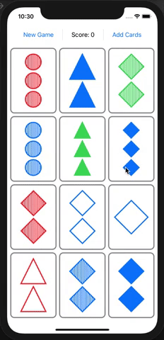

# memorize-ios-stanford-cs139p

Stanford CS139p - Develop Apps for iOS (Spring 2020)  
[Stanford-CS193p Website](https://cs193p.sites.stanford.edu/)  

lecture 1-2: MVVM; Swift Types  
lecture 3-4: RectiveUI; Protocols; layout; Grid; Enum; Optionals  
lecture 5-6: ViewBuilder; ViewModifier; Shape; Animation  
lecture 7-8: Multithreading; Gestures JSON  

## Set card game

Midterm project, my first iOS app!  

